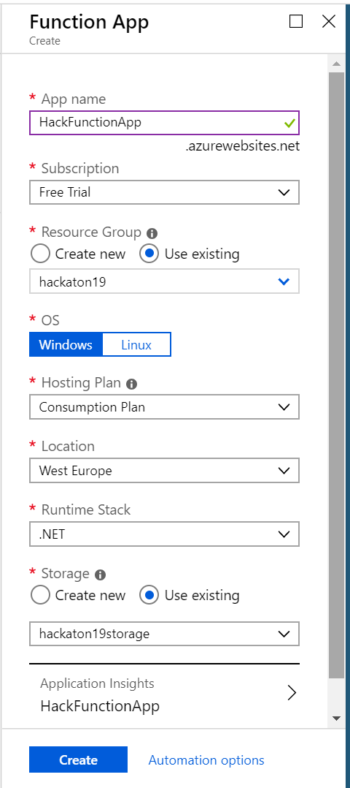
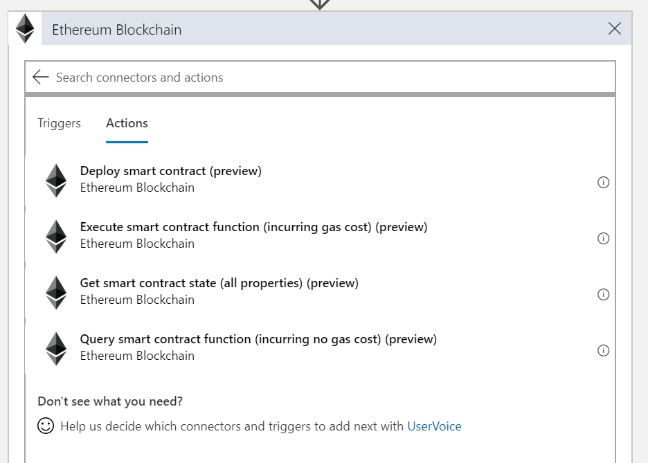

# Easily do an OCR of the image added to SharePoint and log to Ethereum

This sample is intended to showcase the usage of Ethereum blockchain as immutable log of the OCR done to images uploaded to  SharePoint document library.

We will be tracking hash of the image file, image metadata (File Identified, File Name, File Path and ETag) and text from Computer Vision API and storing it on the blockchain.

---
## Requirements 
1. Office365 developer account
2. Azure account

## SharePoint list

1. SharePoint site
    - In case you already have a SharePoint site set-up, note the site URL.
    - Otherwise, navigate to `https://your_org.sharepoint.com` as a site collection admin and Create a new site
    - Choose team site and add site name eq. `Audit`
    - Copy the URL of the team site eq. `https://your_org.sharepoint.com/sites/Audit`

2. Create a Picture Library
    - Navigate to Setting and choose Add an app

    

    - Select Picture Library template and add a name eq. `Tracked Pictures`

    

---

## Computer Vision API

1. Create a new Computer Vision from Azure Marketplace on Azure Portal

2. Grab the keys in the Quick start 

--- 

## Azure Function for hashing

1. Create a Function App from Azure Marketplace on Azure Portal

2. Add new function and select In-portal tile on the Quick start

3. Choose Webhook + API tile to create an function triggered on HTTP request

4. Use the code provided in `hashfunction.csx` file to create an azure function which will hash the request body

--- 

## Smart Contract

1. Create a private Ethereum network
    - You can choose to create a private Ethreum POA network from scratch as described in [this guide](https://github.com/caleteeter/smartcontractdev/blob/master/example1-setup.md)
    - or use an existing template on Azure Marketplace
2. Deploy the AuditLog.sol
    - Deploy the `OcrDocument.sol` smart contract to your Ethereum network by using truffle as described in [this guide](https://github.com/caleteeter/smartcontractdev/blob/master/walkthrough1.md) or by using [Remix IDE](https://remix.ethereum.org)
    - Take a note of the **contract address** and **ABI** as we will need them to connect to the smart contract
    - Take a note of the private key of the account

---

## Logic app

1. Create a new **Logic App** in Azure Portal and use Blank Logic App template
    
    
2. Search for SharePoint connector
2. Choose **When a file is created in a folder** trigger
3. Select SharePoint site from the dropdown or paste site URL eq. `https://your_org.sharepoint.com/sites/Audit`

4. Select a library you created eq. `Tracked Pictures`
- You can select a specific folder within the library
5. Add a Computer Vision API connector

6. Select **Optical Character Recognition (OCR) to Text** action
7. Select **Image content** from the Image Source dropdown
8. Add **File Content** from Dynamic content

9. Add **Azure Function** connector
10. Select the hash function you created

11. The purpose of this step is to create a hash of the image content, so that is the reason why place in the request body the following expression `triggerBody().$content`. Trigger body returns also the content type, so we are taking on the content piece of the body.

12. Repeat the steps 9 & 10 to hash the text Computer Vision API detected in an image
13. Add **Detected Text** to request body

14. We also want to hash the image metadata. Add a new step and repeat the actions 9 & 10
15. Request body should containt the metadata you want to track. Create a json as on shown on the image

16. As the final step we will add the Ethereum Blockchain connector
17. Chose **Execute smart contract function** from the list of supported actions

18. Create a new connection to Ethereum RPC endpoint
    - Enter a connection name
    - Put a RPC endpoint eq. `http://your_ip:port`
    - Paste a private key of the account from your Ethreum network
19. Paste **ABI** you stored earlier
20. Paste address contract has been deployed to
21. Select name of the function from the dropdown eq. `addDocument`
22. In the boxes use dynamic content to fill in the parameters

23. Save the logic app

---

## Test

To verify everything is set correctly
1. Navigate to SharePoint Picture Library and upload a new image

2. Navigate to Logic App in the portal and click on the run history
3. Inspect the inputs and outputs of each step

4. Copy the transaction hash from the output section and verify that it has been confirmed and the event has been raised

5. Interact with the contract by calling `getDocumentHash`, `getTextHash`  or `getMetadataHash` functions

--- 

## Future improvement
This simple scenario is intended to showcase interaction with Etereheum blockchain. To make it more complete, one could use Azure Storage Table to store the detected text and all the metadata.