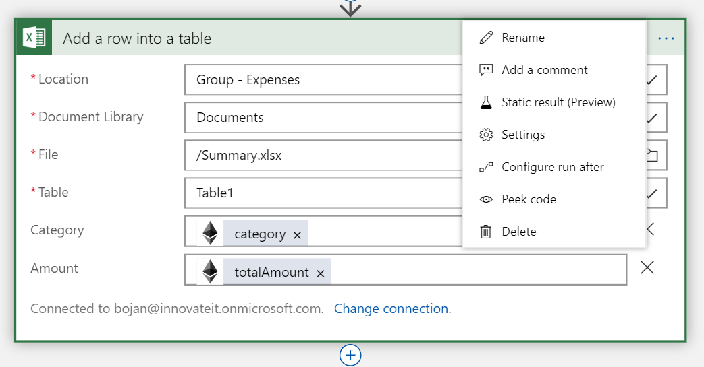

Duplicate the form 

# File your expenses in Forms, store in blockchain and present the data in Excel Online

This sample is intended to display the usage of Ethereum blockchain as store of expense logs and totals per category. This data is presented to the managers using Excel Online. 

The solutions allows employees to file their expenses in Microsoft Forms, entering the Expense Category, Date and Amount. This info is then stored in Ethereum blockchain using Logic Apps and Ethereum Blockchain Connector. Smart Contract stores the category hash, date and amount and emits event of an expense being logged. Besides that, Smart Contract is keeping track of the total amount spent in each category, and emits event when the totals for a category have been updated.
This event is monitored by another Logic App, which in turn updates the Excel file located on SharePoint document library, which displays the spending per category.


---

## Prerequisites  
1. Office365 developer account
2. Azure account

--- 

## Forms

1. Navigate to `http://forms.office.com` and create a new form called `Expenses` or [make a duplicate of this example](https://forms.office.com/Pages/ShareFormPage.aspx?id=LKtUoszetEi7u0Gj14MFu4k0f71m5RhMrDXVzbOrZBJUOU9KRDRYRzMxT0g0VFFTVzdESkE3WFBRSC4u&sharetoken=FrPjxoWq68lT8eUL8OE5)
- If you are building your own the following questions (as shown on the image)
    - Expense category as **Choice** with some predefined options added and an **Other** option
    - Date as **Date**
    - Amount as Text with **Number** restriction


--- 

## Excel Online (Business)

1. Create a new Excel document in your SharePoint document library eq. `Summary.xlsx`
    - In case you do not have SharePoint site set-up, navigate to `https://your_org.sharepoint.com` as a site collection admin and Create site
    - Chose team site and add site name eq. `Expenses`
    - In this sample, we will be using a standard document library that is automatically created for you with the team site template, but you can also create a new document library on the existing site


2. Insert a table with two columns `Category` and `Amount`


3. Optionally, you could insert a chart that will be getting the data from the table
*Note* Each time a new category is added, you will need to update the data source for the chart

--- 

## Smart Contract

1. Create a private Ethereum network
    - You can choose to create a private Ethreum POA network from scratch as described in [this guide](https://github.com/caleteeter/smartcontractdev/blob/master/example1-setup.md)
    - or use an existing template on Azure Marketplace
2. Deploy the `Expenses.sol` located in `contracts`
    - Deploy the smart contract to you Ethereum network by using truffle as described in [this guide](https://github.com/caleteeter/smartcontractdev/blob/master/walkthrough1.md) or by using [Remix IDE](https://remix.ethereum.org)
    - Take a note of the **contract address** and **ABI** as we will need them to connect to the smart contract
    - Take a note of the private key of the account


`Expenses` smart contract defines ExpenseLog struct with the following fields
```
    struct ExpenseLog {
        uint Id;        
        bytes32 CategoryHash;
        string Date;
        uint Amount;        
    }
```
Smart contract emits two events
```
    event ExpenseLogAdded(uint expenseLogId, string category, string date, uint amount);
    event ExpenseTotalsUpdated(string category, uint totalAmount);    
```

It exposes the following methods
- `addLog` is used to add a new expense log to the blockchain and update the totals while emitting the events
- `getTotalAmount` to return the total amount spent on a specific category
- `getCount` to return the number of expenses logged

```
    function addExpenseLog(string memory category, string memory date, uint amount) public {
        uint id = ExpenseLogCount++;
        bytes32 categoryHash = keccak256(bytes(category));

        ExpenseLog memory doc = ExpenseLog({
            Id : id,
            CategoryHash : categoryHash,                        
            Date : date,
            Amount : amount
        });
        
        ExpenseLogs[id] = doc;                
        Totals[categoryHash]+= amount;

        emit ExpenseLogAdded(id, category, date, amount);
        emit ExpenseTotalsUpdated(category, Totals[categoryHash]);

    }

    function getTotalAmount(string memory category) public view returns (uint) {        
        return Totals[keccak256(bytes(category))];        
    }
    
    function getCount() public view returns (uint) {
        return ExpenseLogCount;
    }
```

---

## Write expenses to blockchain using Logic Apps

1. Create a new **Logic App** in Azure Portal and use Blank Logic App template
    
    

2. Search for **Microsoft Forms** connector
3. Choose **When a new response is submitted** trigger
4. Select your form from the dropdown eq. `Expenses`


5. Add **Microsoft Forms** one more time and select **Get response details** action


6. Select `Expenses` form and **List of response notifications Response Id** from the dynamic content panel


7. In the foreach section, add new **Ethereum blockchain** connector and select **Execute smart contract function** action


8. Create a new connection to Ethereum RPC endpoint
    - Enter a connection name
    - Put a RPC endpoint eq. `http://your_ip:port`
    - Paste a private key of the account from your Ethreum network
9. Paste **ABI** you stored earlier
10. Paste address contract has been deployed to
11. Select name of the function from the dropdown eq. `addExpenseLog`
12. In the boxes use dynamic content to fill in the parameters
- Select **Expense category** for **category** parameter
- Select **Date** for **date** parameter
- Select **Amount** for **amount** parameter


13. Save and run the logic app

---

## Listen for events from blockchain and write to Excel Online

1. Next, we will create another **Logic App** in Azure Portal and use Blank Logic App template eq. `UpdateExcel-LogicApp`
2. Add **Ethereum blockchain** connector and select **When a smart contract event occurs** trigger


3. Paste **ABI** you stored earlier
4. Paste address contract has been deployed to
5. Select the `ExpenseTotalsUpdated` event from the dropdown


6. Search for **Excel Online (Business)** connector and select **Get a row** action


7. Set the parameters as shown on the image


8. Add new **Excel Online (Business)** connector and select **Update a row** action
9. Set the parameters as shown on the image


10. Previous step will work whever there is already a row for the expense category. We also need to add a step when an expense with a new category is being submitted. Click on the output of the Get a row step and add a parallel branch


11. Add new **Excel Online (Business)** connector and select **Add a row into a table** action
12. Set the parameters as shown on the image


13. We want this step to execute only when there is not a row for the category we just added, meaning when the **Get a row** step fails. To do this configure run after



14. Make sure that only **has failed** is selected


When completed, logic app should look similar to 


15. Save and run the logic app

---


## Verify

To verify everything is working correctly
1. Fill in the expense form and submit it


2. Wait a couple of minutes or navigate to Logic Apps and check the run history and inspect the inputs and outputs of each step


3. Once completed, the `Summary.xlsx` should look similar to the following


