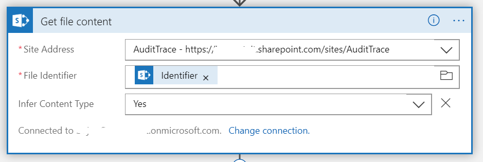

# Simple auditing of changes to SharePoint documents using Ethereum blockchain

This sample is intended to display the usage of Ethereum blockchain as immutable log in auditing purposes to keep track of changes made on the document stored in SharePoint Library.

We will be tracking ID of the modified document, file content (hashed), file metadata (hashed), whether the document has been created or changed and the timestamp(ticks) and storing it on the blockchain.

---

## Prerequisites  
1. Office365 developer account
2. Azure account

--- 

## SharePoint Document Library

1. SharePoint document library
    - In case you already have a SharePoint site set-up, note the site URL.
    - Otherwise, navigate to `https://your_org.sharepoint.com` as a site collection admin and Create site
    - Chose team site and add site name eq. `AuditTrace`
    - Note the URL of the team site eq. `https://your_org.sharepoint.com/sites/AuditTrace`
    - In this sample, we will be using a standard document library that is automatically created for you with the team site template

--- 

## Azure Function for hashing

1. Create a Function App from Azure Marketplace on Azure Portal

2. Add new function and select In-portal tile on the Quick start

3. Choose Webhook + API tile to create a function triggered on HTTP request

4. Use the code provided in `hashfunction.csx` file to create an Azure Function that will hash the request body

--- 

## Smart Contract

1. Create a private Ethereum network
    - You can choose to create a private Ethreum POA network from scratch as described in [this guide](https://github.com/caleteeter/smartcontractdev/blob/master/example1-setup.md)
    - or use an existing template on Azure Marketplace
2. Deploy the AuditLog.sol
    - Deploy the `AuditLog.sol` smart contract to you Ethereum network by using truffle as described in [this guide](https://github.com/caleteeter/smartcontractdev/blob/master/walkthrough1.md) or by using [Remix IDE](https://remix.ethereum.org)
    - Take a note of the **contract address** and **ABI** as we will need them to connect to the smart contract
    - Take a note of the private key of the account

---

## Logic app

1. Create a new **Logic App** in Azure Portal and use Blank Logic App template
    
    

2. Search for SharePoint connector
2. Choose **When a file is created or modified** trigger
3. Select SharePoint site from the dropdown or paste site URL eq. `https://your_org.sharepoint.com/sites/Audit`
4. Select Library name from the dropdown eq. `Documents`

5. Add SharePoint connector one more time as we need to get the file content
6. Select **Get File Content** action 
7. Choose your site address
8. Select **Identifier** from Dynamic content panel for the File Identifier parameter

5. Add **Azure Function** connector
6. Select the hash function you created

7. The purpose of this step is to create a hash of the file content, and that is the reason why place in the request body the following expression `body().$content`. Body returns also the content type, so we are taking only the content piece.

8. Repeat the steps 5 & 6 to hash the file metadata
9. Request body should contain the metadata you want to track. Create a json as on shown on the image

10. We will also be tracking the email of the user who made the changes to the document. To store it on blockchain, we first need to hash it. Repeat the steps 5 & 6.
12. Add **Modified By Email** to the request body

12. Finally, add a step for Ethereum Blockchain connector
13. Choose **Execute smart contract function** from the list of supported actions

8. Create a new connection to Ethereum RPC endpoint
    - Enter a connection name
    - Put a RPC endpoint eq. `http://your_ip:port`
    - Paste a private key of the account from your Ethreum network
9. Paste **ABI** you stored earlier
10. Paste address contract has been deployed to
11. Select name of the function from the dropdown eq. `addLog`
12. In the boxes use dynamic content to fill in the parameters
- Select **ID** for **documentId** parameter
- **documentHash** parameter should contain the output(body) of the **Hash File Content** step
- **metadataHash** parameter should contain the output(body) of the **Hash File Metadata** step
- **documentHash** parameter should contain the output(body) of the **Hash Modified By Email** step
- For the **timestamp** parameter, which is represented as int in the Smart Contract we will use the `ticks(triggerBody()?['Modified'])`

13. Save and run the logic app

---

## Verify
To verify everything is working correctly
1. Navigate to SharePoint document library and create/upload new file or modify an existing one
2. Navigate to Logic App in the portal and click on the run history
3. Inspect the inputs and outputs of each step

4. Copy the transaction hash from the output section and verify that it has been confirmed and the event has been raised

